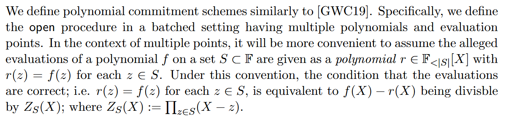
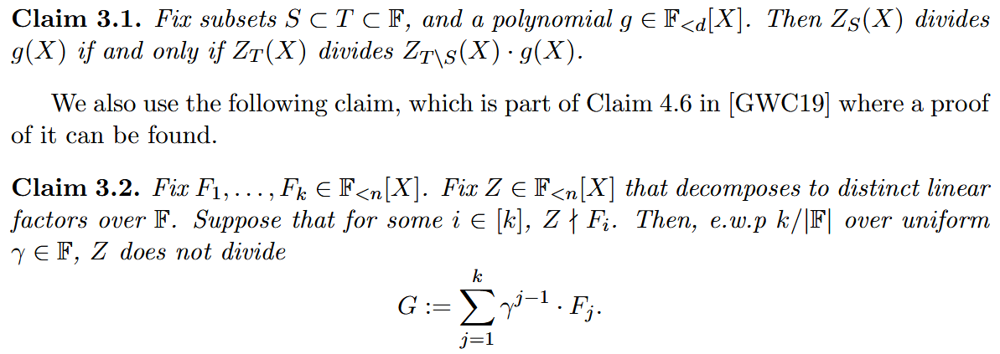
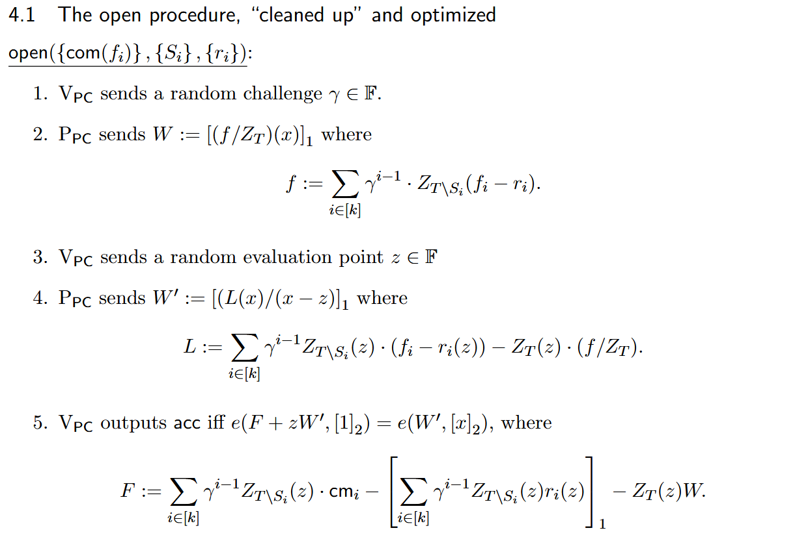
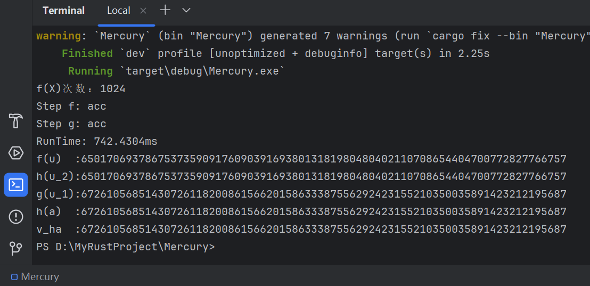

# Mercury

# 总体流程
## Mercury
论文 10 至 12 页

## BDFG20
来对 Mercury 中的 $g(X),\ h(X),\ S(X),\  D(X)$ 进行批量证明。

### $r(X),\ Z_s(X)$ 的定义：

### Claim：

### 证明流程：

# 代码说明

## main.rs
总体流程的实现

## lib.rs
多项式计算的实现

# 结果
1. Step f: acc

2. Step g: acc

3. $h(u_2)=f(u),\ g(u_1)=h(\alpha)=h_{\alpha}$ 

